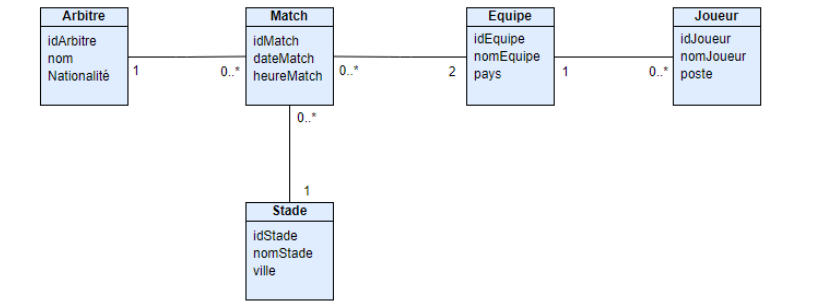

# Description du projet

## Projet de fin de chapitre : Spring Web & Data

Ce projet se concentre sur le développement d'une application de gestion de tournoi de football en utilisant Spring Boot. Les entités fondamentales du système comprennent les Matchs, les Équipes, les Joueurs, les Stades et les Arbitres, comme représenté dans le diagramme de classe ci-joint.

### Objectifs du projet :
- Récupérer tous les matchs, équipes, joueurs, stades et arbitres.
- Enregistrer un nouvel arbitre, stade, match, joueur et équipe.
- Modifier et supprimer un arbitre, un match, un stade, une équipe et un joueur.
- Récupérer toutes les équipes du 'Maroc'.
- Récupérer les matchs prévus pour le '28/02/2021'.
- Récupérer le stade où se déroule le match avec l'ID=3.
- Récupérer tous les joueurs de l'équipe 'ATL MADRID'.
- Récupérer les deux équipes impliquées dans le match avec l'ID=3.
- Récupérer tous les joueurs 'attaquants' de l'équipe 'PSG'.
- Supprimer tous les matchs passés.

  Ce référentiel contient la mise en œuvre du backend pour les fonctionnalités mentionnées ci-dessus en utilisant Spring Boot.

Veuillez vous référer à la [démonstration vidéo](https://youtu.be/yKuwIUiEnEg) pour une présentation visuelle des fonctionnalités de l'application.

